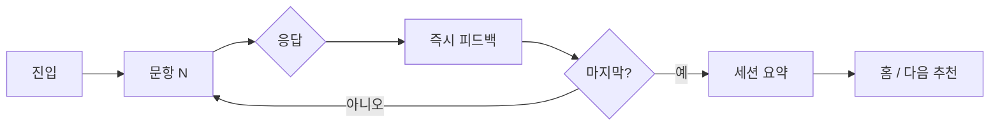

# 핵심 학습 루프

## 세션 정의

- **길이**: 3~5분 (문항 5~8개 또는 일일 세트 고정)
- **구성**: 짧은 프롬프트 → 응답(Pick/Blank) → 즉시 피드백 → XP/진행 반영
- **종료**: 세션 요약 화면 (정답 수, 획득 XP, 스트릭 갱신 여부)

## 표준 세션 흐름

### 1. 진입

- 홈에서 **이어하기**, **일일 챌린지**, **월드 스테이지**, **알고리즘 모드** 중 하나 선택
- 하트·스트릭 상태를 상단에 짧게 표시 (불안 유발 최소화)

### 2. 문항 제시

- Pick: 지문 2~4줄 + 선택지 3~4개
- Blank: 코드 5~15줄 + 빈칸 1~3개 (드래그 블록 또는 키워드 선택)
- **타이머**: MVP에서는 소프트 타이머(권장 시간만 표시). 하드 타임아웃 없음

### 3. 응답

- 한 번 제출 후 즉시 채점 (재시도 규칙은 모드·하트에 따름)
- 오답 시: 정답 하이라이트 + 짧은 해설 (다음 문항으로 자동 진행 가능)

### 4. 피드백

| 유형 | 내용 |
|------|------|
| 정답 | ✓ + 1문장 강화 (“투 포인터로 범위를 좁혔어요”) |
| 오답 | 정답 표시 + 2~3문장: 왜 이 패턴인지, 흔한 실수 1가지 |
| Blank | 빈칸별 정답 코드 스니펫 + 한 줄 의미 |

### 5. 세션 요약

- 정답률, XP, 완료한 스테이지/일일 여부
- **다음 행동 1개만** CTA: “내일 일일”, “World 1-5 이어하기” 등

## 재미·몰입 원칙

| 원칙 | 구현 힌트 |
|------|-----------|
| 빠른 승리 | 첫 세션 80% 이상 정답 가능한 난이도 곡선 |
| 예측 가능한 보상 | 문항당 XP 고정, 세션 완료 보너스 |
| 시각적 진행 | 스테이지 맵·알고리즘 % 바 |
| 실패 비용 낮음 | 하트 소모는 Level/Algorithm; Daily는 별도 규칙 |
| 끊김 복구 | 24시간 내 이어하기 저장 (게스트 포함) |

## 피드백 작성 규칙

1. **먼저 패턴 이름** — “이 문제는 이분 탐색입니다.”
2. **다음 한 줄 근거** — “정렬된 배열에서 O(log n)으로 범위를 줄입니다.”
3. **선택지 오답은 1개만 짚기** (Pick) — 가장 헷갈린 오답 1개에 대해 1문장
4. **Blank는 코드와 연결** — “`while left <= right`가 구간을 유지합니다.”
5. 톤: 존댓말, 짧게, 비난 없음

## 재시도·하트 (요약)

| 모드 | 오답 시 |
|------|---------|
| Pick (연습) | 즉시 1회 재시도 허용 가능 (설정) |
| Pick (시험형 스테이지) | 하트 -1, 재시도 없음 |
| Blank | 빈칸 단위 제출; 전체 오답 시 해설 후 다음 |
| Daily | 하트 무관; 오답 기록만 (스트릭은 완료 기준) |

상세는 [04-gamification.md](04-gamification.md), 모드별는 [03-content-types.md](03-content-types.md).

## 학습 목표 (세션 단위)

사용자가 세션 후 말할 수 있어야 하는 것:

- “이 지문이면 **○○ 패턴**을 떠올렸다.”
- (Blank) “이 빈칸에는 **이 코드 조각**이 들어간다.”

풀이 전체를 쓰지 못해도 **패턴 라벨링**이 되면 세션 성공으로 본다.

## 비목표 (이 루프에서 하지 않음)

- 복잡한 증명·시간 복잡도 증명
- stdin/stdout 제출·채점
- 토론·댓글·리그
