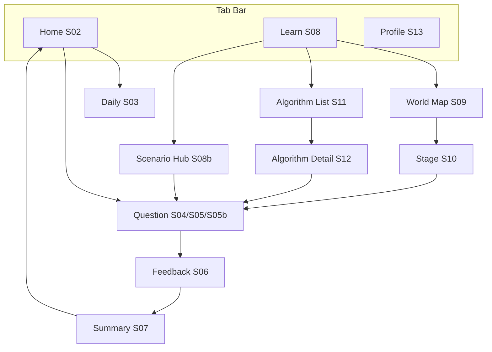

# 정보 구조 · 화면 목록

모바일 1열 기준. 탭 바는 **홈 · 학습 · 프로필** 3개 (MVP). **실전 시나리오**는 Learn Hub 2차 진입(Should) 또는 학습 탭 서브(구현 선택).

## 화면 목록

| ID | 화면명 | 설명 |
|----|--------|------|
| S00 | Splash | 로고, 버전, 게스트 세션 복구 |
| S01 | Onboarding (1~3) | 가치 제안 → 패턴 소개 → 알림(선택) |
| S02 | Home | Daily 카드, 이어하기, World 요약, 스트릭/하트 |
| S03 | Daily Challenge | 오늘 5문항, 진행 dots |
| S04 | Question (Pick) | 지문, 선택지, 제출 |
| S05 | Question (Blank) | 코드, 빈칸 UI, 제출 |
| S05b | Question (Scenario) | 시나리오 지문, 패턴 카드(단일/복수), 선택적 모델링 1문항, 제출 |
| S06 | Feedback overlay | 정오, 해설, 다음 |
| S07 | Session Summary | XP, 정답 수, CTA |
| S08 | Learn Hub | World / Algorithm / **실전 시나리오** 진입 |
| S08b | Scenario Hub (Should) | 카테고리 칩, 난이도, 세션 3~5문항 시작 |
| S09 | World Map | World 1~2 노드 맵 |
| S10 | Stage Detail | 스테이지 미리보기, 시작 |
| S11 | Algorithm List | 6알고리즘 카드 + % |
| S12 | Algorithm Detail | 진행 바, 연습 시작 |
| S13 | Profile | Lv, XP, 뱃지, 스트릭 캘린더 |
| S14 | Settings | 언어(고정), 알림, 계정 |
| S15 | Guest → Account upgrade | Later: 이메일/소셜 연동 |

## 내비게이션

- Question 플로우는 **스택**으로 쌓고, Summary에서 pop to root (Home 또는 Learn)

## 온보딩 플로우

| Step | 내용 | 스킵 |
|------|------|------|
| 1 | “5분이면 패턴이 보여요” + 일러스트 | ✗ |
| 2 | Pick/Blank 10초 체험 (더미 1문항) | ○ |
| 3 | Daily·스트릭 설명, 알림 권한 | ○ |

- 첫 실행만 표시, Profile에서 “튜토리얼 다시보기”
- 체험 문항은 `onboarding_demo_pick` 고정 ID

## 홈(S02) 우선순위

1. Daily Challenge (미완료 시 강조)  
2. 이어하기 (마지막 stage/algorithm)  
3. World 1 진행 노드 미니맵  
4. (Should) **실전 시나리오** 미완료 세트 또는 “오늘의 상황극 1개”  
5. 하트 / 스트릭 / Lv 한 줄  

## 빈 상태

| 상황 | 메시지 방향 |
|------|-------------|
| 하트 0 | “Daily는 하트 없이 할 수 있어요” |
| World 잠금 | “1-4를 클리어하면 열려요” |
| 오프라인 | “연결되면 진행이 저장돼요” (게스트 로컬 우선) |

## 접근성 (Should)

- 선택지 최소 터치 44pt  
- 코드 블록 가로 스크롤 + 글자 크기 설정  

구현 상세는 [13-tech-architecture.md](13-tech-architecture.md)에서 라우팅·상태 보관.
