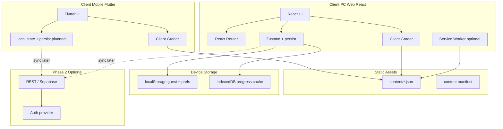
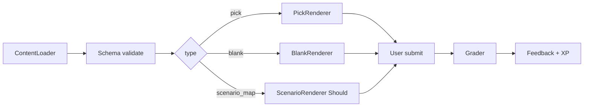
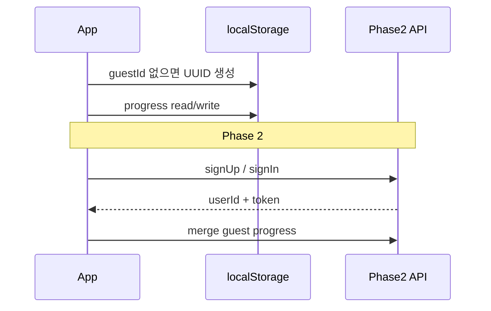

# 기술 아키텍처

MVP 구현을 위한 **클라이언트 중심** 아키텍처 결정 문서입니다. 1인·소규모 팀이 바로 착수할 수 있도록 플랫폼, 폴더 구조, 콘텐츠 배달, 백엔드 단계, Daily·스트릭 로직을 정의합니다.

**관련 문서**: [05-mvp-scope](05-mvp-scope.md) · [06-content-schema](06-content-schema.md) · [09-ia-screens](09-ia-screens.md) · [04-gamification](04-gamification.md)

---

## 1. 아키텍처 목표·제약

| 목표 | 구현 방향 |
|------|-----------|
| **빠른 MVP** | 서버 없이 vertical slice → Must 기능까지 클라이언트 단독 |
| **낮은 운영 비용** | 정적 호스팅 + 번들 JSON, DB·큐 최소화 |
| **모바일 우선 UX** | 1열 레이아웃, 44pt 터치, 3~5분 세션 ([02-core-learning-loop](02-core-learning-loop.md)) |
| **콘텐츠 오프라인 친화** | 문항·월드 메타는 앱 번들 또는 캐시; 네트워크 없이 Daily·스테이지 플레이 가능 |
| **게스트 우선** | 가입 없이 전체 Must 루프; 계정은 Phase 2 |
| **코드 실행 없음** | Pick/Blank는 정답 키 비교만 ([05-mvp-scope](05-mvp-scope.md) Out of scope) |

### 제약 (Must 준수)

- Python만 Blank 코드 표시
- Pick ~50, Blank ~30, World 1~2, 6알고리즘, Daily·스트릭·게스트 진행 저장
- `scenario_map`: MVP Must **제외**, v1.0~1.1 Should — 렌더 파이프라인만 미리 설계

---

## 2. 플랫폼 결정 (확정: 2026-05-17)

**모바일 + PC 웹 분리**. 상세 근거: [18-stack-decision.md](18-stack-decision.md).

| 플랫폼 | 스택 | 경로 | 담당 UX |
|--------|------|------|---------|
| **iOS / Android** | Flutter (Material 3) | `apps/mobile/` | 홈, Daily, Pick/Blank 짧은 세션, 스트릭, World 맵, 게임 톤 UI |
| **PC 웹** | React 18 + Vite 5 + TypeScript | `apps/web/` | 긴 Blank, 코딩, PC 보너스, UI 레퍼런스·프로토타입 |

**이유 (요약)**

1. **사용자 의도** — 일상 학습은 모바일 앱; 넓은 화면·키보드·긴 코드는 PC 웹.
2. **기존 자산** — `apps/web` 홈·Daily slice는 PC 경로·디자인 시안으로 유지; 모바일 기능은 Flutter로만 확장.
3. **MVP에 서버 거의 없음** — 각 클라이언트 로컬 저장(웹: `localStorage`, 모바일: 플랫폼 저장소 예정).
4. **콘텐츠 = JSON** — 루트 `content/` 단일 소스; 빌드 시 각 앱에 번들.
5. **폴더명** — `apps/web`은 rename 하지 않음(PC 역할은 README·문서로 명시).

> **과거 검토**: PWA 단일 스택(ADR-001 초안)은 보류. Capacitor/TWA는 Later.

---

## 3. 시스템 개요 (High-level)



| 구성요소 | MVP | Later |
|----------|-----|-------|
| Client | Flutter (`apps/mobile`) + React PC (`apps/web`) | 푸시, 앱스토어, PWA install (웹) |
| Content | Git 번들 → CDN | CMS 업로드 → CDN 버전 URL |
| Backend | 없음 (Phase 0~1) | Auth, sync, analytics ingest |
| DB | IndexedDB + localStorage | Postgres (Supabase 등) |

---

## 4. 클라이언트 아키텍처

### 4.1 모노레포 폴더 구조

```
algorithm-training/
  apps/
    mobile/                   # Flutter — iOS/Android (MVP 제품 클라이언트)
      lib/
        screens/home/         # 홈 (Daily 플로우 예정)
        theme/
        models/
      assets/images/mascot/
    web/                      # React + Vite — PC 웹·참고 UI (폴더명 유지)
      src/
        screens/              # Home, Daily(PC), …
        lib/                  # progress, daily, grading
        components/
  content/                    # JSON 원본 (06 스키마) — 공유
    questions/
    worlds/
    daily/
  design/assets/mascot/       # 마스코트 원본 PNG
  docs/
```

- **모바일 화면·도메인**: `apps/mobile/lib/` — 09-ia-screens의 홈·Daily·학습 탭 등
- **PC 웹**: `apps/web/src/` — 긴 Blank, 코딩, PC 보너스; Daily는 PC 경로 프로토타입 가능
- **콘텐츠 로더·채점**: 언어별로 동일 규칙; 스키마는 [06-content-schema](06-content-schema.md) 공통

### 4.2 상태 관리

| 계층 | 선택 | 역할 |
|------|------|------|
| UI 로컬 | `useState` | 모달, 애니메이션, 현재 문항 인덱스 |
| 앱 전역 | **Zustand** | guest, progress, hearts, streak, session |
| 영속 | `zustand/middleware` **persist** → localStorage | 가벼운 설정·게스트 ID |
| 대용량 캐시 | **idb-keyval** 또는 Dexie | 문항 시도 이력, 오답 큐 (Should) |
| 서버 (Phase 2) | TanStack Query | sync, conflict resolution |

**원칙**: Redux는 MVP에 과함. 세션 중 문항 배열은 route state 또는 `sessionStore`에만 두고 Summary 후 정리.

### 4.3 라우팅 ↔ 화면 매핑

| Route | Screen ID | 비고 |
|-------|-----------|------|
| `/` | S00 Splash | 세션 복구 후 redirect |
| `/onboarding/:step` | S01 | `step` 1~3 |
| `/home` | S02 | 탭 root |
| `/daily` | S03 | |
| `/question/:sessionId` | S04/S05/S05b | `type` query 또는 session meta |
| `/learn` | S08 | 탭 |
| `/learn/world` | S09 | |
| `/learn/world/:worldId/stage/:stageId` | S10 | |
| `/learn/algorithm` | S11 | |
| `/learn/algorithm/:tag` | S12 | |
| `/learn/scenario` | S08b | Should |
| `/profile` | S13 | 탭 |
| `/settings` | S14 | |
| `/upgrade` | S15 | Later |

```mermaid
flowchart LR
  subgraph stack [Question Stack]
    Q[Question Route]
    F[Feedback overlay state]
    SUM[Summary]
  end
  Q --> F --> SUM
  SUM -->|pop to root| Home[/home]
  SUM -->|pop to root| Learn[/learn]
```

- Question 플로우: nested route 또는 단일 `/session/:id` + 내부 step index ([09-ia-screens](09-ia-screens.md))
- Summary에서 `navigate('/home', { replace: true })` 등으로 스택 정리

### 4.4 로컬 영속 (게스트 진행)

| Key / Store | 저장소 | 내용 |
|-------------|--------|------|
| `guestId` | localStorage | UUID v4, 최초 생성 |
| `userProgress` | localStorage (persist) | XP, Lv, hearts, streak, badges, unlocked stages |
| `dailyCompletions` | localStorage | `{ "2026-05-17": true, ... }` (로컬 날짜 키) |
| `sessionDraft` | sessionStorage | 이어하기 (24h TTL optional) |
| `contentCache` | IndexedDB | world JSON 스냅샷 (오프라인 강화 시) |
| `questionAttempts` | IndexedDB | Should: 오답 복습 큐 |

**마이그레이션**: `progressSchemaVersion` 필드로 store shape 변경 시 upgrade 함수 1개 유지.

---

## 5. 콘텐츠 배달

### 5.1 MVP: 번들 JSON (repo)

| 방식 | 설명 |
|------|------|
| **Primary** | `content/`를 `import.meta.glob` 또는 빌드 전 `scripts/bundle-content.ts`로 manifest 생성 |
| **런타임** | `content/manifest.json`에 해시·버전; 앱 `CONTENT_VERSION` 상수와 비교 |
| **호스팅** | 빌드 산출물과 함께 배포 (별도 CDN 불필요) |

```json
{
  "version": 1,
  "worlds": ["world_1", "world_2"],
  "questions": {
    "pick_arr_001": "./questions/pick/pick_arr_001.json"
  },
  "daily": "./daily/manifest.json"
}
```

### 5.2 버전·지연 로드

| 단위 | 로드 시점 |
|------|-----------|
| manifest + 공통 UI | 앱 부트 |
| `world_1.json` | World Map 진입 또는 홈 미니맵 |
| `world_2.json` | World 2 잠금 해제 후 |
| `algorithm/{tag}.json` | Algorithm Detail 진입 |
| 개별 question | 스테이지 시작 시 `questionIds` batch fetch (dynamic import) |

- **Lazy**: `const q = await import(\`../../content/questions/pick/${id}.json\`)` — Vite가 청크 분리
- **무결성**: 빌드 시 Zod/AJV로 [06-content-schema](06-content-schema.md) 검증 스크립트 (CI)

### 5.3 렌더·채점 파이프라인 (개념)



| type | Renderer | Grader 규칙 |
|------|----------|-------------|
| `pick` | stem + choices | `selectedId === correctChoiceId` |
| `blank` | codeTemplate + slot UI | 각 blank: trim 후 `correctAnswers` 포함 여부 |
| `scenario_map` | patternChoices (+ optional modeling) | `selected ∈ primaryPatternIds` (MVP: 1개) |

- **서버 채점 없음** — 정답 키는 클라이언트 번들에만 존재; DevTools 노출은 MVP 수용 (치트 방지는 Phase 2·리더보드 시)

---

## 6. 백엔드 전략 (단계별)

### Phase 0 — Vertical slice (서버 없음)

- 게스트 UUID, 1 Pick + 1 Blank, 피드백, XP 로컬 반영
- 목표: [02-core-learning-loop](02-core-learning-loop.md) 1플로우 E2E

### Phase 1 — MVP (여전히 대부분 클라이언트)

| 필요할 수 있는 것 | 클라이언트만 가능? | 권장 |
|-------------------|-------------------|------|
| 진행 저장 | ◎ localStorage/IDB | MVP: 로컬만 |
| Daily 문항 세트 | ◎ manifest 또는 결정론적 seed | **pre-authored `daily/`** 우선 |
| 스트릭 | ◎ 로컬 날짜 | 서버 불필요 |
| 분석 (DAU, 완료율) | △ | **선택**: Plausible/PostHog snippet (익명) |
| 푸시 | ✗ | Should, Web Push + 최소 worker |
| 다기기 동기화 | ✗ | Phase 2 |
| 리더보드 | ✗ | Later ([04-gamification](04-gamification.md)) |

**결론**: MVP Must는 **백엔드 없이 출시 가능**. 서버는 “진행 백업·계정” 요구가 생길 때 추가.

### Phase 2 — 계정·동기화·확장

- Email/OAuth, progress merge (guest → user)
- 선택: 주간 비동기 리더보드, CMS webhook

### 백엔드 스택 (필요 시 1문단씩)

| 스택 | 적합한 경우 |
|------|-------------|
| **Supabase** | Postgres + Auth + RLS로 진행 JSON 1테이블 sync; 빠른 MVP 백엔드, 대시보드 |
| **Firebase** | 익숙한 팀, Firestore document sync, Analytics·FCM 푸시 통합 |
| **Lightweight Node (Hono/Fastify) + SQLite/Postgres** | API shape 완전 통제, 콘텐츠 CMS 자체 구축 시 |

권장 순서: **로컬 only → Supabase** (스키마 단순, auth 내장). Firebase는 푸시·모바일 앱 확장 시 유리.

---

## 7. 인증·식별



| 단계 | 식별 |
|------|------|
| MVP | `guestId` (UUID) — 기기 로컬, 재설치 시 초기화 |
| Phase 2 | Supabase Auth 등 — `userId` + `guestId` merge 정책 (서버 wins vs max XP) |

**과구축 금지**: refresh token rotation, 소셜 5종, 비밀번호 정책 UI — MVP 제외.

---

## 8. Daily 챌린지·스트릭 (클라이언트)

### 8.1 Daily 세트 결정

**권장 (MVP)**: **Pre-authored calendar**

```json
{
  "id": "daily_2026_05_17",
  "date": "2026-05-17",
  "questionIds": ["pick_hash_002", "pick_bs_001", "blank_tp_001", "pick_stack_001", "blank_bfs_001"]
}
```

- `daily/manifest.json`에 90일분 미리 두거나 주 단위 생성
- 앱: `getTodayDailyId(timezone)` → manifest lookup
- **장점**: 콘텐츠 품질 통제, QA 가능, 모든 사용자 동일 세트 (커뮤니티)

**대안**: 결정론적 PRNG

```ts
// 의사코드 — manifest 없을 때 fallback
function dailyQuestionIds(dateKey: string, pool: string[], count: number): string[] {
  const seed = hashString(`daily-v1-${dateKey}`);
  return seededShuffle(pool, seed).slice(0, count);
}
```

- `dateKey`: `Asia/Seoul` 기준 `YYYY-MM-DD`
- pool: Must 전체 ID 또는 난이도·태그 균형 배열
- vertical slice에서 manifest vs PRNG **하나만** 선택 (ADR-002)

### 8.2 스트릭 규칙

| 항목 | 규칙 |
|------|------|
| 인정 | 로컬 캘린더 날짜에 Daily **완료** (5문항 세션 종료) |
| 타임존 | default `Asia/Seoul` — `Intl` / `date-fns-tz` |
| 리셋 | 날짜 변경 후 전일 미완료 → `streak = 0` |
| Grace period | MVP **없음** ([04-gamification](04-gamification.md)); Later: streak shield |

### 8.3 엣지 케이스

| 케이스 | 처리 |
|--------|------|
| 자정 직전 시작·직후 완료 | **완료 시점** 날짜로 기록 |
| 타임존 변경 (여행) | 설정에서 TZ 고정 또는 “학습 기준 지역” 1회 선택 (Should) |
| 하루 2회 Daily | 첫 완료만 streak·XP; 두 번째는 연습 모드 (XP 0 또는 감소) |
| 오프라인 완료 | 로컬 완료 표시; manifest에 해당일 없으면 가장 가까운 fallback day |
| 시스템 시계 조작 | MVP 무시; 리더보드 도입 시 서버 날짜 |

### 8.4 의사코드 (스트릭 갱신)

```ts
function onDailyComplete(completedAt: Date, tz: string, state: ProgressState) {
  const dayKey = formatInTimeZone(completedAt, tz, 'yyyy-MM-dd');
  if (state.dailyCompletions[dayKey]) return; // already done

  state.dailyCompletions[dayKey] = true;
  const yesterday = addDays(dayKey, -1);
  if (state.lastStreakDay === yesterday) {
    state.streak += 1;
  } else if (state.lastStreakDay !== dayKey) {
    state.streak = 1;
  }
  state.lastStreakDay = dayKey;
}
```

---

## 9. 비기능 요구사항

### 9.1 성능·번들

| 지표 | 목표 (MVP) |
|------|------------|
| FCP (4G) | < 2s |
| Question 전환 | < 100ms (로컬 데이터) |
| 초기 JS (gzip) | < 200KB (route code-split) |
| content 청크 | world 단위 < 100KB gzip |

- Lighthouse 모바일 Performance ≥ 80 (내부 목표)
- 이미지: SVG/웹폰트 위주, 무거운 일러스트 lazy

### 9.2 접근성

- 선택지·버튼 min **44×44px**
- `aria-live`로 정오 피드백 읽기
- 코드 블록: 가로 스크롤, `prefers-reduced-motion` 존중
- 색만으로 정오 구분 금지 (아이콘 병행)

### 9.3 i18n

- MVP UI 문자열: **한국어** (`src/i18n/ko.json`)
- 문항 `stem`/`explanation`은 JSON KO ([06-content-schema](06-content-schema.md))
- 구조: `react-i18next` 또는 lightweight key map; 영문 UI는 Later

---

## 10. 보안·프라이버시 (요약)

| 항목 | MVP |
|------|-----|
| 사용자 코드 실행 | **없음** — Blank는 문자열 매칭만 |
| 정답 노출 | 클라이언트 번들; 리더보드 전까지 허용 |
| PII | 게스트만 — UUID, 진행 데이터 (로컬) |
| Analytics | 익명 이벤트, IP 최소화 (PostHog EU 등 선택) |
| HTTPS | 호스팅 기본 제공 |
| CSP | `default-src 'self'`; inline script 최소 (Vite 기본) |
| Content integrity | 빌드 시 JSON schema validate; `contentVersion` 표시 (Settings) |

---

## 11. 개발 환경·도구

| 영역 | 권장 |
|------|------|
| Package manager | **pnpm** (또는 npm — 팀 1인이면 lockfile만 고정) |
| 언어 | TypeScript strict |
| Lint | ESLint + eslint-plugin-react-hooks |
| Format | Prettier |
| Test runner | **Vitest** |
| Component test | 선택 — React Testing Library (Question·Grader 우선) |
| E2E | Later — Playwright 1 smoke (Daily 완료) |

### 테스트 우선순위 (unit)

1. `dailyResolver` — 날짜·manifest·fallback
2. `streakCalculator` — 연속·끊김·중복 완료
3. `pickGrader` / `blankGrader` — trim, multi-blank
4. `xpCalculator` — [04-gamification](04-gamification.md) 표
5. content validation script — CI

### CI (GitHub Actions 제안)

```yaml
# .github/workflows/ci.yml (개념)
on: [pull_request]
jobs:
  check:
    runs-on: ubuntu-latest
    steps:
      - uses: actions/checkout@v4
      - uses: pnpm/action-setup@v4
      - run: pnpm install --frozen-lockfile
      - run: pnpm lint
      - run: pnpm test
      - run: pnpm validate-content   # JSON schema
      - run: pnpm build
```

---

## 12. 배포

| 단계 | 대상 |
|------|------|
| Preview | PR마다 Vercel/Netlify Preview URL |
| Production | `main` → production branch, auto deploy |

**PWA 체크리스트**

- `manifest.webmanifest` (name, icons, `display: standalone`)
- Service Worker: precache shell + runtime cache `content/` (Should for offline)
- `theme-color`, apple-touch-icon

**앱스토어 (Later)**

- **Capacitor** wrapper → 기존 Vite 빌드 재사용
- 또는 **TWA** (Android) / App Store는 메타데이터·스크린샷 비용 고려

---

## 13. 미결정 사항 · ADR 플레이스홀더

| ID | 결정 | 옵션 | 검증 시점 |
|----|------|------|-----------|
| ADR-001 | MVP 플랫폼 | ~~PWA~~ → **Flutter + React PC** ✓ ([18-stack-decision](18-stack-decision.md)) | 2026-05-17 확정 |
| ADR-002 | Daily 소스 | pre-authored manifest ✓ / PRNG seed | 첫 30일 콘텐츠 작성 시 |
| ADR-003 | 상태 persist | localStorage only / + IndexedDB | 오프라인 Must 여부 |
| ADR-004 | Blank UI | 키워드 픽 / 드래그 블록 | UX 프로토 1주 |
| ADR-005 | Service Worker | off / precache shell | Lighthouse 오프라인 테스트 |
| ADR-006 | Analytics | none / Plausible / PostHog | MVP 출시 2주 전 |
| ADR-007 | Hearts 회복 | 30분×1 / 4시간×1 | [04-gamification](04-gamification.md) 플레이테스트 |
| ADR-008 | Phase 1 backend | none ✓ / Supabase | 다기기 요청 발생 시 |

---

## 14. 다음 문서 (`14-api-spec.md`)에서 정의할 항목

[14-api-spec.md](14-api-spec.md)는 **백엔드를 도입할 때** 클라이언트·서버 계약을 고정합니다. 아키텍처 기준 초안 목차:

- **범위**: Phase 0 (없음) vs Phase 1 (optional analytics) vs Phase 2 (auth + sync)
- **리소스 모델**: `User`, `GuestProgress`, `DailyCompletion`, `StageProgress`
- **REST 또는 Supabase table** shape — JSON 필드는 클라이언트 `ProgressState` mirror
- **Endpoints (Phase 2)**  
  - `POST /auth/register`, `POST /auth/login`  
  - `GET /progress`, `PUT /progress` (idempotent, `If-Match` version)  
  - `POST /progress/merge` (guestId → userId)  
  - `GET /daily/:date` (서버 authoritative daily — multi-device 시)
- **에러 코드·재시도**: 409 conflict, offline queue semantics
- **인증**: Bearer JWT / Supabase session — header 규약
- **Rate limit·pagination**: N/A MVP
- **Webhook (Later)**: CMS `content` publish → CDN invalidate
- **클라이언트 SDK**: fetch wrapper, sync debounce (5s), background sync optional

---

## 부록: MVP Done ↔ 아키텍처 매핑

| [05-mvp-scope](05-mvp-scope.md) Done | 아키텍처 요소 |
|--------------------------------------|----------------|
| 게스트 Daily 1회 + 스트릭 | `daily/`, `streakCalculator`, localStorage |
| World 1 스테이지 1→3 | `world_1.json`, progress unlock |
| Pick·Blank 로드·채점 | ContentLoader + Grader |
| 재실행 후 XP·진행 유지 | Zustand persist + `guestId` |

---

## 15. 개발 착수 (코드 우선)

| 클라이언트 | UI 기준 | 실행 |
|------------|---------|------|
| 모바일 | `apps/mobile/` (Flutter) | `cd apps/mobile && flutter run` |
| PC 웹 | `apps/web/` (React) | `cd apps/web && npm run dev` |

Figma는 참고용. 홈 레이아웃·토큰은 웹 프로토와 동기화 후 **모바일이 제품 기준**으로 수렴. 로컬 실행: [17-dev-setup.md](17-dev-setup.md).

---

*문서 버전: 1.1 · 플랫폼: Flutter (mobile) + React (PC web) · ADR: [18-stack-decision.md](18-stack-decision.md)*
