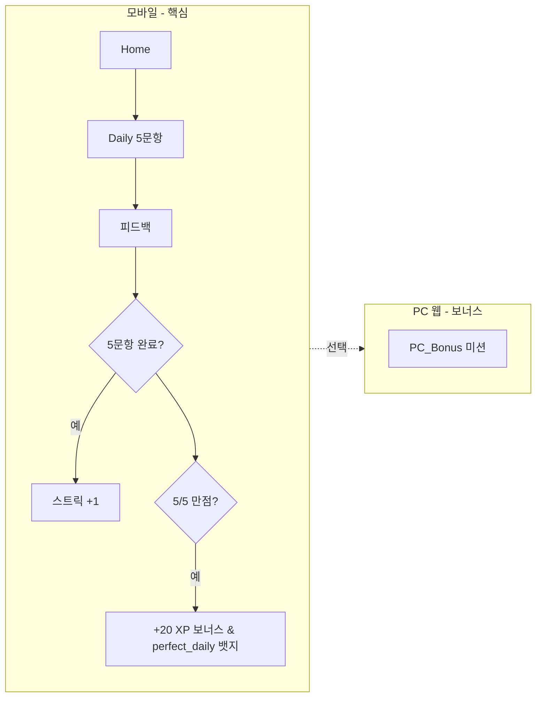

# 학습·플랫폼 흐름 (협의 확정)

> **협의 확정 반영** — 채팅에서 합의한 제품명·플랫폼·스트릭·톤을 한 문서로 정리합니다. UI 상세는 [16-algofit-figma-brief.md](16-algofit-figma-brief.md), 기존 루프·모드는 [02-core-learning-loop.md](02-core-learning-loop.md), [03-content-types.md](03-content-types.md)를 따릅니다.

---

## 제품 정체

| 항목 | 확정 내용 |
|------|-----------|
| 앱명 | **알고핏 (Algofit)** |
| 포지션 | 알고리즘 **패턴** 3~5분 학습 (백준 풀이 대체 아님) |
| 톤 | 가벼운 게임 — XP, 스트릭 불꽃, 월드 맵, 즉시 피드백 |
| 캐릭터 | **A** 무료 에셋 + **B** 커스텀 마스코트 (`design/assets/mascot/`) |

---

## 플랫폼 B

| 채널 | 역할 | MVP 우선순위 |
|------|------|----------------|
| **모바일 앱** (또는 모바일 PWA) | Daily 5문항, World, Algorithm, 핵심 루프 | **Must** |
| **PC 웹** | 보너스 미션·넓은 화면 연습 | **Bonus only** — 스트릭·Daily 완료의 필수 조건 **아님** |

PC 보너스 예: 추가 XP, 주간 챌린지, Blank 긴 코드 연습 등. 모바일에서 일일 목표를 끝낸 뒤 “더 하고 싶을 때”만 유도.

---

## 일일 챌린지 · 스트릭

| 규칙 | 협의 확정 |
|------|-----------|
| 일일 세트 | **5문항** (Pick/Blank 혼합 가능) |
| **스트릭 인정** | 해당 로컬 날짜에 **5문항 응답 완료** (정답률 무관) |
| 만점 보상 | 5/5 정답 시 `perfect_daily` 뱃지 + **+20 XP 보너스** |
| 부분 완료 | 5문항을 다 풀면 스트릭 인정. 도중에 그만두면 미갱신 |
| 하트 | Daily는 하트 소모 없음 ([04-gamification.md](04-gamification.md)) |

> **설계 의도**: 스트릭은 "꾸준함" 보상, 만점은 "도전 성취" 보상 — 분리해서 운영합니다. 1문제만 맞아도 끝까지 풀면 스트릭이 유지되어 학습 좌절을 줄입니다. ([02-core-learning-loop.md](02-core-learning-loop.md) "실패 비용 낮음" 원칙과 정렬)

---

## 표준 학습 세션 (모바일)

1. **Home** — 스트릭·하트·Daily 카드·World 요약  
2. **Daily 또는 스테이지** — 문항 → 즉시 피드백 ([02-core-learning-loop.md](02-core-learning-loop.md))  
3. **세션 요약** — XP, 다음 CTA 1개  
4. **World Map** — 스테이지 진행 시각화  

화면 ID 매핑: [09-ia-screens.md](09-ia-screens.md)  
Figma 프레임: [16-algofit-figma-brief.md](16-algofit-figma-brief.md) (`01_Home` ~ `05_World_Map`, `PC_Bonus`)

---

## 게임화 요약

| 요소 | 동작 |
|------|------|
| XP | 문항·세션·일일 완료 보너스 ([04-gamification.md](04-gamification.md)) |
| 스트릭 | Daily 5문항 완료 시 +1 (정답률 무관), 자정 미충족 시 리셋. 만점은 별도 뱃지·보너스 |
| 하트 | Level/Algorithm 오답 시 소모, Daily 무관 |
| 맵 | World 1~2 노드 — `05_World_Map` |

---

## 디자인 · 개발 연결

| 단계 | 담당 | 산출물 |
|------|------|--------|
| 1 | 사용자 | [15-figma-mcp-setup.md](15-figma-mcp-setup.md) — Figma MCP + OAuth |
| 2 | 사용자 | Figma 파일 **Algofit**, [16-algofit-figma-brief.md](16-algofit-figma-brief.md) 프레임 |
| 3 | 사용자 → 에이전트 | 프레임 URL 공유 (예: `01_Home`) |
| 4 | 에이전트 | MCP로 컨텍스트 읽기 → 코드·PWA 구현 |

---

## 관련 문서

| 문서 | 내용 |
|------|------|
| [16-algofit-figma-brief.md](16-algofit-figma-brief.md) | 토큰·프레임·컴포넌트 |
| [15-figma-mcp-setup.md](15-figma-mcp-setup.md) | MCP 설정 |
| [05-mvp-scope.md](05-mvp-scope.md) | Must/Should 범위 |
| [13-tech-architecture.md](13-tech-architecture.md) | PWA·동기화 |
